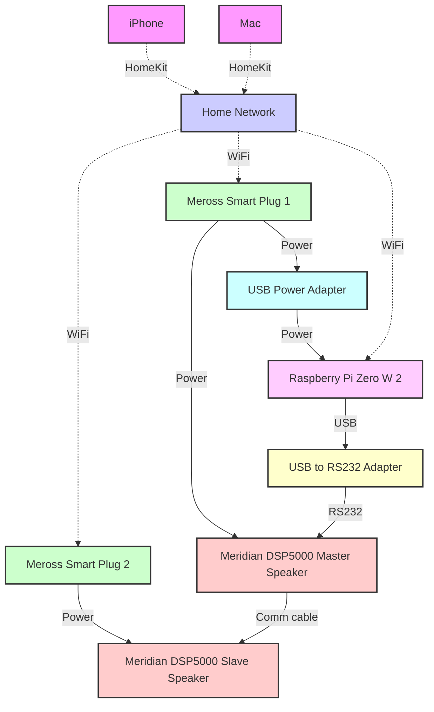

# Automating Meridian DSP5000 Speaker Activation for One-Click Audio Bliss

I love my Meridian DSP5000 speakers, but turning them on was a hassle: activate plugs, find remote, power up, adjust volume. It felt outdated compared to my smart home. I envisioned a simpler solution - one click/tap on my Mac/iPhone to power up the speakers and set the perfect volume. As the video below show, that's what I've managed to achieve!:

I'll walk you through my set-up which automates activating my Meridian DSP5000 speakers using a Raspberry Pi, a USB to RS232 cable, a bit of coding magic and HomeKit. Hopefully, it'll be helpful to fellow Meridian DSP5000 owners who want the simplicity of one-tap music.

## The Cast of Characters: The Kit

1. Two Meridian DSP5000 speakers:

   

2. Two HomeKit compatible Meross WiFi Smart Plugs grouped together in HomeKit:

   

3. Raspberry Pi Zero W 2 with a fast MicroSD card:

    

4. USB to Serial RS232 Adapter with FTDI Chipset:

   

5. USB Plug Adaptor (for powering the Raspberry Pi):

    

## The Cast of Characters: The Connections

Here's how everything connects:

## The Brain of the Operation: Configuring the Raspberry Pi

The Raspberry Pi acts as a bridge between the smart home ecosystem and the RS232 interface of the Meridian speakers by the adapter. Here's how I set it up:

1. Operating System: [DietPi](https://dietpi.com), a lightweight Debian-based OS, to ensure fast boot times
2. Boot Script ([activate.sh](https://github.com/henry-morris/meridian-maestro/blob/main/activate.sh)), this script waits for the USB-to-Serial device to be available, then sends commands to set the speakers to CD input and 90% volume. 
3. Systemd Service ([activate.service](https://github.com/henry-morris/meridian-maestro/blob/main/activate.service)), to run the activate.sh script at boot

## The Grand Finale

With this setup, when I turn on the smart plugs via HomeKit, the first plug activates both the Master speaker and the Raspberry Pi simultaneously. The Pi boots up, runs the script to configure the speakers, and then shuts itself down. The whole process takes about 15 seconds from plug activation to having the speakers ready at the perfect volume.
